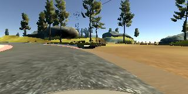
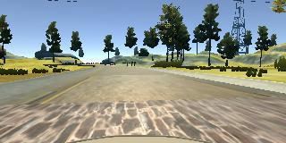
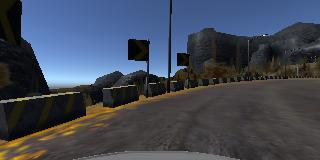
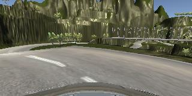
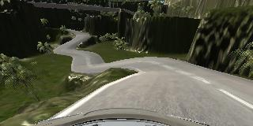
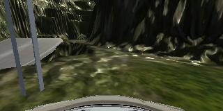

#**Behavioral Cloning** 

##Project Writeup

_Author: Luc Frachon - March 13, 2017_

---

**Behavioral Cloning Project**

The goals / steps of this project are the following:

* Use the simulator to collect data of good driving behavior
* Build, a convolution neural network in Keras that predicts steering angles from images
* Train and validate the model with a training and validation set
* Test that the model successfully drives around Track One without leaving the road
* Summarize the results with a written report

[//]: # (Image References)

[image1]: ./im/angle_correction.png "Camera angle correction"
[image2]: ./im/steering_angle_curve.png "Steering angle correction curve"
[image3]: ./im/originals.png "Original images"
[image4]: ./im/brightness.png "Random brightness adjustments"
[image5]: ./im/translate.png "Random translations"
[image6]: ./im/crop.png "Cropped & resized image"
[image7]: ./im/crop_flip.png "Same, flipped"

---

##A. Model and training

###1. Files Submitted & Code Quality

####1.1. Submission includes all required files and can be used to run the simulator in autonomous mode

With this submission, I included the following files:

* `network_large.py`: My final ConvNet architecture, derived from the nVidia architecture [(Ref.1)](#ref1).
* `import_data.py`: The code used to import data, augment it, pre-process it and build generators to feed batches into the model
* `drive.py`: The code used to drive the car. It is based on the provided code but I added the possibility to pass different a target speed as well as multipliers to the steering and throttle inputs. I also included data pre-processing into it in line with what is applied to validation sets during the training phase.
* `model_final.h5`: The trained model, passed to `drive.py` to drive the car in autonomous mode.
* `track1.mp4`: A video recording of the model completing 1 lap of track 1.
* `track2.mp4`: A video recording of the model completing track 2 (mountain).
* `track3_edit.mp4`: A video recording of the model completing 1 lap of track 3 (jungle), slightly edited to indicate when manual braking was applied.

####1.2. Submission includes functional code

* **To run the model on track one, follow the steps below:**

	1. Start the 50MHz simulator (the 10MHz sim does not work as well and more importantly, does not contain the mountain track which I also tested the model on) and select the faster graphics quality (this is what I used to train the model). Other options will works too but with a slightly lower accuracy.
	2. Open another terminal window and activate the `carnd-term1` environment
	3. Type `python drive.py model_final.h5`. This runs the model with a target speed of 25, a steering multiplier of 1. and a throttle multiplier of 1., which work well on this track. You can also increase the target speed to 30 if you like, adding the optional flag `-s 30`. Note that the driving parameters used for the mountain track also work (see below) but generate a slightly wobblier drive, with the car meandering from left to right on the straights.

* **To run the model on track two (mountains), follow the steps below:**

	1. Start the 50MHz simulator. Screen resolution does not seem to matter much, however you will need to select the fastest graphics quality in order to prevent the model from getting confused with shadows (see the [Reflection](#reflection) section).
	2. Open another terminal window and activate the `carnd-term1` environment
	3. Type `python drive.py model_final.h5 -m 1.4 -t 1`. This runs the model with a target speed of 25, a steering multiplier of 1.4 and a throttle multiplier of 1., which work better on this track. You can also increase target speed to 30 with a steering multiplier of 1.5, without any noticeable loss in accuracy.

I also made an attempt at the "jungle track", provided with the 10MHz simulator. To achieve this I drove on that track as well using the same strategy as described later, but due to the fact that this simulator records five times less data, it constitutes only a small portion of the overall data that the model was trained on. It performs reasonably well on most of the track except on one occasion where it might go off track for reasons unclear. I can manually reverse back into the track and then the car goes on. The model also sometimes switches lanes, which I believe could be corrected with more training on a two-lane road (the jungle track is the only track to display this feature). Finally, I had issues with throttle inputs (see the discussion on [testing](#testing).

* **To run the model on the jungle track, follow the steps below:**

	1. Start the 10MHz simulator, as the other application does not include this track. Select the fastest graphics quality.
	2. Open another terminal window and activate the `carnd-term1` environment.
	3. Type `python drive.py model_final.h5 -s 12 -m 2.2 -t 0.2`. This runs the model with a target speed of 15, a steering multiplier of 2.0 and a throttle multiplier of 0.2, which work better on this track.
	4. Be prepared to manually reverse out of the ditch in at least one spot! If that happens, simply bring the back onto the correct lane using manual controls.
	

Ideally, I would have liked to train a model that uses the same driving parameters for all three tracks (speed, steering and throttle multipliers), but unfortunately I ran out of time. As it is, the model works on both track 1 and 'mountain' with identical parameters (steering multiplier = 1.4) but on track 1, the driving is smoother with steering multiplier = 1.

####1.3. Submission code is usable and readable

The `model_final.py` file contains the code for training and saving the convolution neural network. The file shows the pipeline I used for training and validating the model, and it contains comments to explain how the code works.

###2. Model Architecture

####2.1. General Design Strategy

I started by building the helper code to import images in an early version that did not use a generator. I then coded a rudimentary neural network using dense layers only to test the basic concepts with a very small sample of data.

I then wrote the code to generate training batches during the training phase, using a Python generator as suggested in the project videos. This allowed me to use the full data set provided by Udacity.

The next step was to improve the model architecture. To save time, I decided to start from the nVidia model [(Ref.1)](#ref1) and added dropout layers after each Dense layer, to prevent overfitting. At that point, my desktop computer was no longer up to the task as I have an AMD GPU, which I couldn't use with the CUDA libraries. I therefore set up a "GPU Compute" AWS EC2 instance and all the subsequent training was performed on it.

After checking that the whole pipeline worked as intended (which naturally involved hours of debugging), I decided that it was time to record more data. I describe the data collection process into more detail [below](#data-collection).

Then began an iterative process of tuning metaparameters, training, testing, until no further progress seemed possible with the available dataset. I then decided to implement data augmentation and pre-processing. I developped several functions to add random translations, random brightness adjustments and histogram adjustments. For translations, I add a steering correction depending on the direction of the translation. Finally, I add horizontally flipped copies of each image (with the opposite steering angle as the outcome to predict).

In addition to the above, I also pick randomly from the left, center and right camera view for each timestamp of the training data and apply a correction to the steering angle. I describe these corrections in more detail below.

At that point I had a decent model for track one (although it displayed an unhealthy affinity for yellow lines and red and white kerbs), but I couldn't get the car go drive around the mountain track without hitting a wall or concrete barrier.

In an attempt to increse the model's accuracy, I did three things:

 - Increased the depth of the network,
 - To prevent overfitting, I added extra dropout units and L2 regularization everywhere,
 - Recorded my own dataset, with data from track one as well as the mountain and jungle tracks.

Then as I was running out of time came a major breakthrough: I realized that in addition to target speed, I could also add a multiplicative factor in the `drive.py` file that is used to execute the model in autonomous mode. Setting it to 1.4 almost immediately allowed me to complete the mountain track.

Given more time, I could have tried to streamline the model now that I know the steering multiplier trick. Maybe a simpler model would work equally well or even better, but that is something I was not able to work before the submission deadline.

####2.2. An appropriate model architecture has been employed

The model I used in this project is derived from the aforementioned nVidia architecture [Ref. 1](#ref1). The differences are:

 - Input shape is different (I used 40 x 80 vs. the original 66 x 220)
 - A 1x1x6 convolution layer after normalization, increasing depth to 6
 - Consequently, depths of the next two 5x5 conv layers increased to 48 and 72 (vs. 24 and 36 respectively in the original nVidia paper)
 - Depth of the next 3x3 conv layer increased to 96 (vs. 64)
 - Replace next 3x3x64 layer with a 1x1x128 layer
 - Depth of next 3 dense layers increased to 128, 64 and 16 (from 100, 50, 10)
 - Dropout layers inserted after each activation
 - L2 regularization used on every convolutional or dense layer

####2.3. Attempts to reduce overfitting in the model

To prevent overfitting, the following measures were taken:

 - Record data on all three tracks in both directions
 - Augment data by generating randomly shifted and brightness-adjusted copies, selected at random in each batch for every epoch of the training process
 - Insert dropout layers after each ReLU activation unit, using a constant keep probability of 50%
 - Use L2 regularisation 
 - Split the dataset into train (80%) and validation (20%) sets. Please note, the data on which the model is actually trained is not the raw images from the train set, but random batches with random transformations applied to them. Each batch contains both the unflipped and the flipped images.

> *Note:* Detecting overfitting is far from obvious. The only measure of accuracy that we have is subjective (beyond the vehicle staying on track). Of course one could say that if the vehicle manages track 1 but not the other two, it is overfitting, but I believe this is too restrictive a definition because the other two tracks have far more challenging features; thus this could also be a case of high bias rather than high variance.
It seems to me that overfitting could manifest itself by sudden unexplainable behavior of the car: A sudden turn  where there is no curve, a sudden attraction to a wall...
The behaviour of my final model is not entirely free of such behavior: for instance, on track one, it sometimes skims the red and white kerbs; on the mountain track it sometimes get very close to the side lines; on the jungle track is goes off track on a couple of occasions. Whether these are instances of overfitting or not is hard to tell.

####2.4. Model parameter tuning

Besides model architecture, the training parameters available for tuning are: Batch size, initial learning rate, number of epochs, corrective angle for left/right cameras, color depth of images, dropout probability.

> *Note:* At test time, there is mainly target speed and steering multiplier, which I discussed earlier.

Parameter tuning was another challenge. The correlation between parameter adjustments and driving quality is sometimes hard to understand and so this phase can be very time-consumming. I quickly discarded color depth to stick to RGB (grayscale just wasn't working). With regards to learning rate, I set the initial rate at 0.0001 and did not touch it afterwards, as I am using the Adam optimizer which is able to adjust its learning rate automatically.
To speed up tuning time, I started using subsamples of data and only trained full models once I thought I had a good set of parameters.

Of course this was an iterative process and each change to the model required a new search through the parameter space to find the right combination.

 
####2.5. Final architecture

|Layer (type)                     |Output Shape          |Param #     |Connected to         |
|---------------------------------|----------------------|:----------:|---------------------|
|Lambda - Normalization           |(None, 40, 80, 3)     |0           |lambda_input_1[0][0] |
|Convolution2D - 1x1, stride 1    |(None, 40, 80, 6)     |24          |lambda_1[0][0]       |
|Activation - ReLU                |(None, 40, 80, 6)     |0           |convolution2d_1[0][0]|
|Convolution2D - 5x5, stride 2    |(None, 18, 38, 48)    |7248        |activation_1[0][0]   |
|Activation - ReLU                |(None, 18, 38, 48)    |0           |convolution2d_2[0][0]|
|Dropout - Keep 50%               |(None, 18, 38, 48)    |0           |activation_2[0][0]   |
|Convolution2D - 5x5, stride 2    |(None, 7, 17, 72)     |86472       |dropout_1[0][0]      |
|Activation - ReLU                |(None, 7, 17, 72)     |0           |convolution2d_3[0][0]|
|Dropout - Keep 50%               |(None, 7, 17, 72)     |0           |activation_3[0][0]   |
|Convolution2D - 3x3, stride 2    |(None, 5, 15, 96)     |62304       |dropout_2[0][0]      |
|Activation - ReLU                |(None, 5, 15, 96)     |0           |convolution2d_4[0][0]|
|Dropout - Keep 50%               |(None, 5, 15, 96)     |0           |activation_4[0][0]   |
|Convolution2D - 1x1, stride 1    |(None, 5, 15, 128)    |12416       |dropout_3[0][0]      |
|Activation - ReLU                |(None, 5, 15, 128)    |0           |convolution2d_5[0][0]|
|Dropout - Keep 50%               |(None, 5, 15, 128)    |0           |activation_5[0][0]   |
|Flatten                          |(None, 9600)          |0           |dropout_4[0][0]      |
|Dense                            |(None, 128)           |1228928     |flatten_1[0][0]      |
|Activation - ReLU                |(None, 128)           |0           |dense_1[0][0]        |
|Dropout - Keep 50%               |(None, 128)           |0           |activation_6[0][0]   |
|Dense                            |(None, 64)            |8256        |dropout_5[0][0]      |
|Activation - ReLU                |(None, 64)            |0           |dense_2[0][0]        |
|Dropout - Keep 50%               |(None, 64)            |0           |activation_7[0][0]   |
|Dense                            |(None, 16)            |1040        |dropout_6[0][0]      |
|Activation - ReLU                |(None, 16)            |0           |dense_3[0][0]        |
|Dropout - Keep 50%               |(None, 16)            |0           |activation_8[0][0]   |
|Dense                            |(None, 1)             |17          |dropout_7[0][0]      |

Total number of parameters: 1,406,705

The model took about 90 minutes to train on an AWS EC2 GPU Compute instance. The most cumbersome part was transfering all the training data from my local computer to the server, as I had over 3GB of data and hit Linux's limit on file counts. I therefore had to split the data in three groups, zip them individually, tranfer the zip files and unzip on the server, which took well over an hour.

###3. Training strategy

####3.1. Data collection

I devoted a lot of time to data collection. For smoother steering inputs, I used a Logitech G25 steering wheel and was very careful about the car's position on the road. For each of the three tracks, I recorded the following:
 - 2 laps one way
 - 2 laps in the reverse direction
 - 1 "recovery" lap one way, where I would bring the car to one side of the road, hit "record" and drive back to the center of the road. I did this on the straights and on the inside and the outside of curves to provide the model with examples of every conceivable scenario
 - 1 "recovery" lap in the reverse direction

Track 1 and the mountain track were both recorded at 50MHz whereas the jungle track was recorded at 10MHz. Thus, I had roughly 5 times less data for the latter. Moreover, when driving the jungle track, I kept the car on the right-hand lane, which is a unique feature of this track.

The collected data amounts to a total of approximately 3GB and 160,000 timestamps, which seems like a very large dataset compared to some discussions I saw on Slack or the forums. This was then used as the base dataset on which to apply various pre-preocessing and data augmentation routines, which I detail below.

Out of the 160,000 timestamps, 20% were set aside randomly as a validation set.

####3.2. Data augmentation and pre-processing

The purpose of data augmentation here is not to increase the amount of data available, as I already have a very large dataset, but rather to help the model generalize better, for instance to situations where the car is far from the ideal central position.

To achieve this, each **training batch** is built by:

 - Randomly selecting an image from left, center and right camera
 - Randomly adding horizontal and vertical translations, from a uniform distribution within the range [-30, +30] pixels,
 - Cropping the top 55 and bottom 25 pixels to retain only the parts than contain the road
 - Resizing it to 40x80
 - Randomly selecting brightness adjustments, from a random distribution within the range [0.70, 1.30], capped at a maximum value of 255 to avoid errors
  - Applying histogram equalization to improve contrast
 - Appending this image and its horizontally flipped counterpart to the training batch
 - During training, the image is normalized to values within the range [-1., +1.] by a Keras Lambda layer

Whenever applying horizontal translation, image flipping or simply selecting a left- or right-camera image, the corresponding steering input needs to be corrected. Discussion on this point [below](#angles).

The following images show the different transformation steps with their impacts on the steering angle. Due to the random nature of these transformations, images at each step may not be consistent with one another (i.e. different translation amounts, different brightness):

* **Original images** from cameras left, center and right:
![alt text][image3]

* **Random brightness adjustment applied**, cameras left, center and right:
![alt text][image4]
  
* **Random translations applied**, cameras left, center and right:
![alt text][image5]

* **Cropped and resized image**, cameras left, center and right:
![alt text][image6]

* **Cropped, resized and flipped image**, cameras left, center and right (note that the apparent position of the camera is also reversed):
![alt text][image7]

**Validation batches** are built in the same way, except that no data augmentation (random translations and brightness adjustments) is used and only center-camera images are considered.

####3.3. Steering angle adjustments

There are three occasions during training batch generation where steering angles need to be modified:

 - Image flipped horizontally: The steering angle is simply reversed ($\sigma$ := $-\sigma$)
 - Left- or Right-hand camera image selected: See discussion below.
 - Image translated horizontally: A fixed steering correction is applied for every pixel of translation. For consistency, this correction is proportional to the angle correction for left and right images, with a fixed coefficient that I determined empirically. A detailed calculation would have been possible, but after I made the decision discussed below, there was no point in refining this second or third-order term.
 
**Selecting the right steering angle correction for left and right camera images:**

When steering into a left-hand corner, the car is in a situation similar to below:

![alt text][image1]
(_drawing by me_)

 where:
  - $\sigma$ = steering angle (average of left and right wheels, or ignoring [Ackerman geometry](https://en.wikipedia.org/wiki/Ackermann_steering_geometry))
  - $w$ = distance between the center and left/right-hand cameras (assumed to be half the width of the car)
  - $T$ = target point on the road that the driver is aiming for
  - $d$ = distance between the center camera and $T$
  - $\alpha_L$, $\alpha_R$ = corrective angles to be applied to $\sigma$ for left and right camera images, respectively.

Using trigonometry, I derived that:

$\alpha_L = arctan \big (\frac{w.cos(\sigma)}{d - w.sin(\sigma)} \big )$
$\alpha_R = arctan \big (\frac{w.cos(\sigma)}{d + w.sin(\sigma)} \big )$
(angles expressed in radians).

Our steering angle is limited to -25° / +25° which corresponds to -0.436 / +0.436 rad. Plotting this function whithin that range (and assuming $w = 1$ and $d = 10$) we get the following curve for $\alpha_L$ (the curve for $\alpha_R$ is the same, flipped horizontally):

![alt text][image2]
(_plotted on Google Search_)

The curve shows that we are navigating around the function's maximum and that $\alpha_L$ varies between 0.085 and 0.100. However in autonomous mode, the actual steering angle rarely exceeds 8-10°, which correspond to corrections in the range of 0.096 to 0.100.

On the other hand, implementing this correction explicitly adds yet another meta-parameter to tune (namely, $d$) and introduces arctan, sin and cos functions which are [quite expensive](http://latkin.org/blog/2014/11/09/a-simple-benchmark-of-various-math-operations/).

Based on the obsercations above, I decided to keep the angle correction constant. I tried several values (effectively picking several $d$'s) and settled with 0.28.

####3.4. Training process

With the model set up, the data acquired and the pre-processing and augmentation functions written and debugged, I was ready to train the final model and test it.

In order to simplify the training process and not having to worry about the learning rate, I chose an Adam optimizer, defining mean square error as my loss function and measuring accuracy.

For each epoch, I had Keras display the training loss, training accuracy, validation loss and validation accuracy. I was surprised to see that validation loss and accuracy were significantly better than the training metrics. My interpretation is that the training data set contains a range of jittered images from 3 different cameras and thus consitutes a harder data set than the validation set, which is more consistent.

I found that validation loss kept decreasing until the 27th to 30th epoch. I therefore used 30 epochs. Fine-tuning this parameter might lead to a slightly better accurracy but we would be at risk of overfitting the validation set so I prefered not to go into too much detail.

---

##B. Testing

I tested the model on all three available tracks.

**Track 1**

- The models drives around the whole track without going off road, for as long as I will let it run, at any speed. 
- It behaves well in the curve with the gravel surface on the outside, whereas some earlier models would go straight into the dirt section.

 
*The car gets close to the gravel roadside, but stays on tarmac*

- The bridge is not an issue and it handles the tarmac change quite well.

*No problem with surface transitions*

- The sharper turns are handled well too.

However the drive is not perfect, and I spotted the following possible improvements:

- The car seems attracted to lines and especially the red and white kerbing in the first and penultimate curves.

*The car puts two wheels over the red and white kerbing. Maybe it thinks it is on a race track...*

- The drive is quite wobbly, with the car turning left and right in rapid succession on the straights. This can be improved somewhat by reducing speed from 30 to 25 or 20 and steering multiplier to 1.0, but never completely goes away. I saw a blog post from Andrew Hogan (linked from the project's Slack channel) that says that using a non-constant steering correction for left and right camera images improves stability significantly [Ref. 2](#ref2). I will try this once the project is submitted.

**Track 2 - Mountain**

- The car drives almost perfectly at 25mph, staying nicely in the center of the road most of the time.
- No problems with the (gentle) elevation changes on this track, nor with bumps

*Elevation change and bumps: No problem!*

- Wobbles are far less apparent than on track 1, partly because there are less straight sections.

- There is one fairly "close shave" moment where the car looks like it is going to hit the outside concrete barriers, but it turns and avoids them.

*Nothing to worry about...*

Overall, the qualty of the driving seems at its best on this particular track.

**Track 3 - Jungle**

- The car follows the lines quite well and stay in its lane most of the time, but there are occasions where the turns are so sharp that it has to change lanes. After this, it tries to stay in its new lane.

*A lane changed caused by a sharp left turn*

- I had issues with inconsistent throttle input. In particular, I noticed that just after severe gradients where the car might struggle going uphill, speed suddenly increases very sharply up to 30mph, which often causes the car to crash. To aleviate this problem, I had to manually brake on a few occasions during the recorded run. Lowering the throttle multiplier to 0.2 helps, but doesn't completely solve the issue. A more complete model that would also learn to brake and accelerate would probably do better.

*Time to apply the brakes*

- The car goes off track in one of the curves, although it didn't look nastier than some of the hairpins. I had to manually reverse back onto the road.

 
*Off-roading...*

---
##C. Reflection

This project was hard but a lot of fun. I understand now why neural networks are described as "black boxes": I often found it difficult to correlate changes made to the model or parameters to the changes in car behaviour. This makes models tricky to improve and requires a very structured approach. Given the significant training times, it is advisable to sub-sample the data during the tuning phase.

To compound difficulty, it is not always obvious whether driving was actually improved from one iteration of the model to the next, especially when trying to assess it over three tracks. As a result, it is often unclear whether we should complexify the model or try to reduce overfitting.

Due to the lack of time and up-coming commitments, I had to stop this project here for submission, however future possible developments would be:

- Simplify the model: With the trick of adjusting steering response via a multiplier during the test phase, maybe a simpler model would work equally well and be faster to train
- Transfer learning: An alternative to the above would be to use a pre-trained model such as VGGNet, replace the last few dense layers and retrain it.
- Try to implement the trigonometric function calculated above, in lieu of a constant steering correction for left and right camera images.
- For fun: As a motorsport fan, I would like to try and train another model to drive like a racing driver, ie. use racing lines rather than staying on the center of the road. This is challenging because the position of the car depends on a lot more factors, such as its current speed, where we are in the turn (entry / apex / exit), what is coming next (Another turn, in which direction? A combination of turns? A straight?) etc.

___

##D. References:

 * Ref. 1: https://arxiv.org/pdf/1604.07316.pdf 
*"End-to-End Learning for Self-Driving Cars"* - Mariusz Bojarski, Davide Del Testa, Daniel Dworakowski, Bernhard Firner, Beat Flepp, Prasoon Goyal, Lawrence D. Jackel, Mathew Monfort, Urs Muller, Jiakai Zhang, Xin Zhang, Jake Zhao, Karol Zieba

 * Ref. 2: https://hoganengineering.wixsite.com/randomforest/single-post/2017/03/13/Alright-Squares-Lets-Talk-Triangles
*Alright Squares; Let's Talk Triangles* - Andrew Hogan, posted on *Random Forest - Machine Learning and NN*
